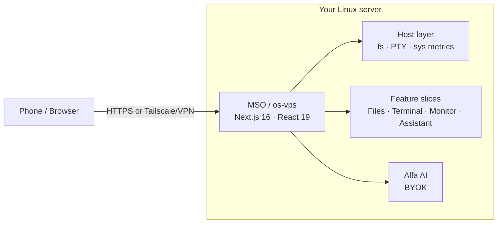

<h1 align="center">Manef Shell OS</h1>

<p align="center"><strong>Your Linux server, finally usable from your phone.</strong></p>

<p align="center">
  Open a real terminal, manage files, inspect system health, and use AI from one private browser workspace.
</p>

<p align="center">
  <a href="https://os.rahmanef.com"><strong>Live Demo</strong></a>
  ·
  <a href="./docs/media/demo.gif"><strong>Watch Demo</strong></a>
  ·
  <a href="#install"><strong>Install</strong></a>
</p>

<p align="center">
  
  
  
  
  
</p>

<p align="center">
  
  
  
  
  
</p>

**Manef Shell OS** (**MSO** in the UI) is an open-source, mobile-friendly visual shell for a Linux server you own. It brings a real terminal, file manager, live system metrics, and a BYOK AI assistant into one private browser workspace without running a full remote desktop.

MSO is **Public Alpha / Developer Preview** software. It runs on top of Linux as a normal non-root Node process. It is not an operating system, Linux distribution, desktop environment, VPS provider, or production-grade security platform.

For a real deployment, put MSO behind **Tailscale, a VPN, or a TLS reverse proxy with tight access control**. Do not expose the raw app port to the public internet.

## Product screenshot/video


<p align="center">
  
</p>

## What you can do

- **Open a real terminal** — interactive PTY support for tools like `vim`, `top`, and `ssh`.
- **Manage files** — browse, upload, search, preview, rename, move, copy, zip, and delete within configured filesystem roots.
- **Inspect system health** — view live CPU, memory, disk, network, process, and uptime signals.
- **Use AI with your own keys** — Alfa uses BYOK credentials stored on your server, not committed to the repo.
- **Work from phone or laptop** — browser UI with desktop, tablet, and mobile shell layouts.

## Three real use cases

- **Emergency phone admin** — restart a service, inspect logs, or edit a config when SSH on mobile is painful.
- **Personal VPS cockpit** — keep terminal, files, metrics, and quick links together for the one server you own.
- **Private AI-assisted ops** — ask an assistant for help while host actions stay gated by your own login and keys.

## Live demo

The public demo should be deployed from a separate checkout with:

```bash
NEXT_PUBLIC_OS_DEMO=1 pnpm build && pnpm start
```

Demo mode skips login, forces mock data, and blocks live host API access. Use it for Product Hunt traffic. A real owner deployment should stay behind Tailscale/VPN or a protected HTTPS proxy.

- Live demo: <https://os.rahmanef.com>
- Watch demo: [docs/media/demo.gif](./docs/media/demo.gif)

## Install

One command on your Linux server installs prerequisites, builds MSO, generates local credentials, and sets up the `os-vps.service` systemd unit:

```bash
curl -fsSL https://raw.githubusercontent.com/rahmanef63/os-vps/main/scripts/install.sh | bash
```

Run it as your normal server user, **not root**. The installer prints the first-login password once and explains how to approve your first browser device.

Useful options:

```bash
curl -fsSL https://raw.githubusercontent.com/rahmanef63/os-vps/main/scripts/install.sh | bash -s -- --port 4005
curl -fsSL https://raw.githubusercontent.com/rahmanef63/os-vps/main/scripts/install.sh | bash -s -- --no-service
curl -fsSL https://raw.githubusercontent.com/rahmanef63/os-vps/main/scripts/install.sh | bash -s -- --uninstall
```

Full production setup, TLS/VPN notes, filesystem roots, updates, and rollback steps live in [docs/INSTALL.md](./docs/INSTALL.md).

## Security warning

An authenticated MSO session can read allowed files and run commands as the user that owns the process. Treat it like SSH in a browser.

- Run as a dedicated non-root user.
- Prefer Tailscale or a VPN; otherwise use HTTPS plus a strict firewall or allowlist.
- Use a strong `OS_SESSION_SECRET` and a strong `OS_LOGIN_PASSWORD`.
- Approve only devices you own; device approval is an allowlist, not standards-based 2FA.
- Keep write roots narrow with `OS_FS_WRITE_ROOTS`.
- Never commit `.env.local`, API keys, or data from `~/.os-vps`.
- MSO has not had a third-party security audit.

More detail: [docs/FAQ.md](./docs/FAQ.md) and [docs/INSTALL.md](./docs/INSTALL.md).

## How it works

MSO is a single Next.js app that runs on your server as one non-root Node process. The app talks to host capabilities through local server routes and keeps features as vertical slices under `frontend/slices/<slug>/`.



Deep dive: [docs/ARCHITECTURE.md](./docs/ARCHITECTURE.md).

## Comparison

Each tool below solves one part of headless-server admin. MSO combines the common owner workflows into one mobile-friendly browser workspace.

| | **MSO** | Cockpit | ttyd | FileBrowser | Netdata | Tailscale SSH |
|---|:---:|:---:|:---:|:---:|:---:|:---:|
| Real PTY terminal | yes | yes | yes | no | no | yes |
| File manager | yes | partial | no | yes | no | no |
| Live system metrics | yes | yes | no | no | yes | no |
| Built-in BYOK AI | yes | no | no | no | no | no |
| Mobile-friendly workspace | yes | partial | partial | partial | partial | no |
| No full remote desktop | yes | yes | yes | yes | yes | yes |
| One-command install | yes | partial | yes | yes | partial | yes |

## Development

```bash
pnpm install
cp .env.example .env.local
pnpm dev
```

Quality gates:

```bash
pnpm typecheck
pnpm lint
pnpm test
pnpm check
pnpm build
```

The package manager is pinned in `package.json` as `pnpm@10.32.1`. Use pnpm so the lockfile and native `node-pty` build path stay predictable.

Full guide: [docs/DEVELOPMENT.md](./docs/DEVELOPMENT.md).

## Documentation

| Doc | What's in it |
|---|---|
| [docs/INSTALL.md](./docs/INSTALL.md) | Server install, credentials, systemd, TLS/VPN, updates, rollback |
| [docs/DEVELOPMENT.md](./docs/DEVELOPMENT.md) | Local dev, quality gates, pnpm, deploy hazards |
| [docs/ARCHITECTURE.md](./docs/ARCHITECTURE.md) | App shell, host layer, slices, routing |
| [docs/MODELS-INTEGRATION.md](./docs/MODELS-INTEGRATION.md) | Alfa AI and BYOK model providers |
| [docs/FAQ.md](./docs/FAQ.md) | Security posture, device approval, costs, product boundaries |
| [docs/TROUBLESHOOTING.md](./docs/TROUBLESHOOTING.md) | Common install, build, and deployment failures |

## Status

MSO is **Public Alpha / Developer Preview**. The core auth, filesystem bounds, terminal, metrics, and slice architecture are implemented, but the project is still early and unaudited. Expect rough edges, breaking changes, and missing production hardening.

## License

MIT — see [LICENSE](./LICENSE).
