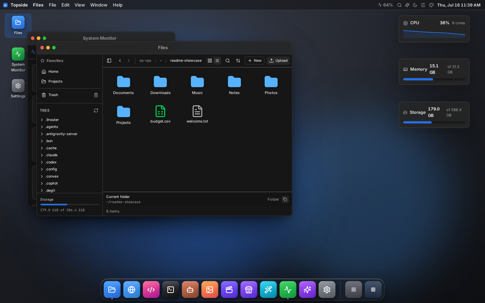
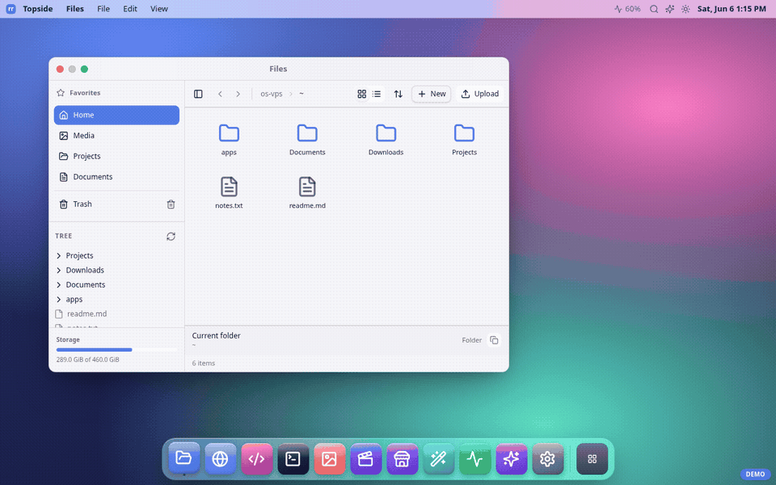
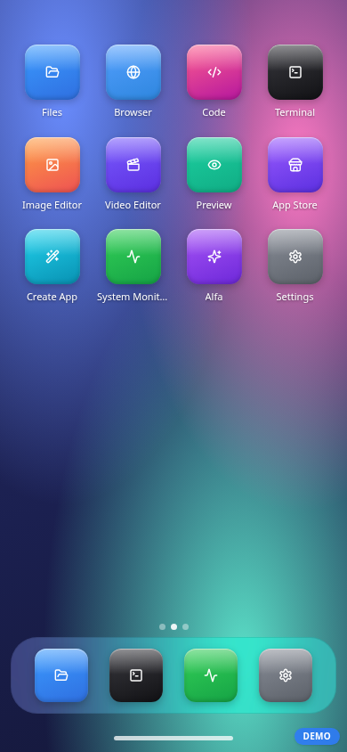
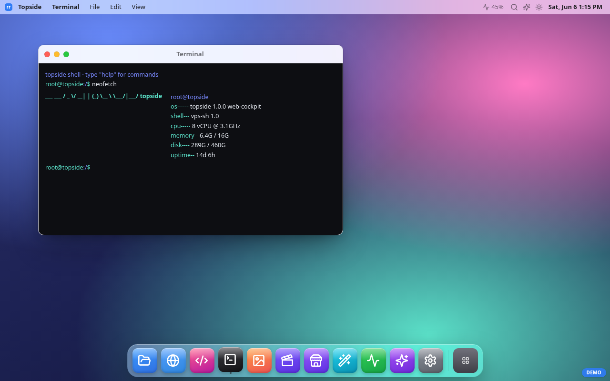
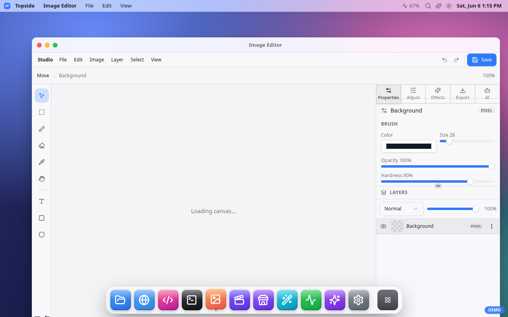

# Topside — a mobile-first web cockpit for a headless Linux VPS

> Repo/service slug stays `os-vps` (deploy paths, systemd unit, domain). "Topside"
> is the product name shown in the UI.

Terminal, file manager, system monitor, media preview and a real remote browser
for your server — from any browser, especially a phone. It presents a
desktop-style UI, but the value is **utility**: fast control of a headless box
without the weight of XRDP / VNC.



<p align="center">
  
</p>

| Mobile-first | Terminal | Image editor |
|:---:|:---:|:---:|
|  |  |  |

It runs *on* the server as a normal user process and talks to the machine
directly. Single Next.js app — **no database, no external agent**.

```
phone / browser ──https──> os-vps (Next.js, :4005) ──┬── lib/host → Node fs / child_process (host, non-root)
                  signed-cookie auth (lib/auth)        └── os-browser (Playwright, :4002, loopback, optional)
```

## What this is — and is NOT

**IS:** a lightweight, single-owner web control plane for one headless VPS you
own. A faster, phone-friendly alternative to a remote desktop for everyday admin.

**IS NOT:** a real operating system, a Linux GUI replacement, a multi-user/
multi-tenant product, or a public SaaS. The macOS/iOS-style shell is a UI
metaphor, not an OS.

It overlaps with Cockpit, ttyd, FileBrowser, Netdata and Tailscale SSH — each
solves one piece. This stitches the common ones into a single mobile-first pane.

## Threat model

- **Trust boundary:** an authenticated session = the owner. By design the owner
  can read files (within configured roots) and run shell commands as the process
  user. Treat a valid session like an SSH login.
- **Assumptions:** one owner; runs as a **non-root** user; reached over HTTPS;
  ideally behind a VPN / Tailscale, or a reverse proxy with TLS if exposed.
- **What protects you:** device-approval 2FA, HMAC-signed `httpOnly`+`Secure`
  +`SameSite=strict` session cookies, per-IP + global login rate limits, an exec
  burst limit, a filesystem jail (realpath-checked read/write roots), a
  destructive-command guard, and an append-only **audit log**.
- **What it does NOT do:** it is not hardened for hostile public internet without
  a network boundary, and it is not a sandbox — within the FS roots the owner has
  real access. There is no second human to approve dangerous actions.

> **Security warning:** an authenticated user has effective remote shell on this
> box. Run it behind Tailscale/VPN (or strict IP allowlist), keep the password
> strong, approve only your own devices, and review `~/.os-vps/audit.log`.

## Security model (mechanics)

- **Login** = shared password (`OS_LOGIN_PASSWORD`, memorable factor) **+ device
  approval** (the strong factor). A new device with the right password lands
  *pending* with no session until an approved device — or `scripts/approve-device.js`
  — promotes it.
- **Session** = HMAC-signed cookie keyed by `OS_SESSION_SECRET` (≥32 bytes, fail
  closed). Default lifetime **24h** (`SESSION_EXPIRY_HOURS`). Sessions are
  stateless: revoking a device blocks future logins but does **not** invalidate
  an already-issued cookie — it stays valid until it expires.
- **Cookie requires HTTPS** (`Secure` is unconditional): over plain HTTP the
  browser silently drops it and login never completes. TLS is mandatory even
  behind a VPN.
- **CSRF is depth-2**: `SameSite=Strict` cookie **plus** a `Sec-Fetch-Site`/
  `Origin` same-origin check in `proxy.ts` on every mutating `/api` request.
  Clickjacking is blocked with `frame-ancestors 'none'` + `X-Frame-Options: DENY`.
- **Reads** are bounded to `OS_FS_READ_ROOTS` (default: home + `~/projects`).
  Even inside a root, the app's **own credential files are denylisted** —
  `.env*` in the app directory and everything under `~/.os-vps/` (device
  allowlist, BYOK key, browser profile) can never be read or written through
  the FS API, so a stolen session can't exfiltrate `OS_SESSION_SECRET` and
  mint cookies forever.
- **Writes** are bounded to `OS_FS_WRITE_ROOTS` (default: home + `~/projects`,
  narrower than reads; root dirs refused). Symlinks are realpath-resolved
  **before** the bounds check, so a link can't escape a root.
- **Exec** runs one-shot bash as the process user, 30s timeout, 1 MiB output cap,
  a per-device burst limit, and a **destructive-command guard** that refuses
  `rm -rf /`, `mkfs`, `dd` to a block device, fork bombs, recursive `chmod/chown`
  on `/`, etc. (override with `OS_EXEC_ALLOW_DESTRUCTIVE=1`; do real disk work
  over SSH).
- **Audit log** — every exec, file mutation, browser action and auth event is
  appended as JSONL to `OS_AUDIT_LOG` (default `~/.os-vps/audit.log`). Reads are
  not logged.
- **Remote browser** — a Playwright headless Chromium (`os-browser/`, optional)
  bound to **loopback**, reached server-to-server with a shared secret
  (constant-time compared) that never touches the client. It only accepts
  `http(s)` URLs (`file://`, `chrome://` etc. are refused) — but it **is a real
  browser on your box**: an authenticated owner can point it at LAN/internal
  addresses (including cloud metadata endpoints). That's by design; treat it
  with the same trust as the terminal.

## Minimum security checklist (before serious use)

- [ ] Strong `OS_LOGIN_PASSWORD`; `OS_SESSION_SECRET` from `openssl rand -hex 32`.
- [ ] Reach it over a VPN/Tailscale, or a TLS reverse proxy + IP allowlist.
- [ ] Keep `OS_FS_READ_ROOTS` tight (do **not** set `/` on an exposed box).
- [ ] Run as a non-root user (the provided systemd unit does).
- [ ] Keep `os-browser` on loopback; firewall :4002 and :4005 from the public net.
- [ ] Review `~/.os-vps/audit.log` periodically.
- [ ] Never commit `.env.local` (password + secrets live there).

## Quickstart

```bash
pnpm install
cp .env.example .env.local      # set OS_LOGIN_PASSWORD + OS_SESSION_SECRET (openssl rand -hex 32)
pnpm build
pnpm start                      # serves on :3000 (or PORT)

# approve the device that will log in (id shown on the login screen):
node scripts/approve-device.js <deviceId> "my phone"
```

Run behind a reverse proxy with TLS (Caddy/nginx/Traefik) or as a systemd
service. The optional Browser app needs the Playwright service in
[`os-browser/`](./os-browser) running with `OS_BROWSER_URL`/`OS_BROWSER_SECRET`.

**Production setup** (credentials, systemd, TLS, browser service, demo mode,
updating): **[docs/INSTALL.md](./docs/INSTALL.md)**. Common questions:
[docs/FAQ.md](./docs/FAQ.md). Something broken:
[docs/TROUBLESHOOTING.md](./docs/TROUBLESHOOTING.md).

## Resource usage and hardware sizing

Measured on the production `os-vps.service` after `next build` + `next start`
(Node 22.22.1 / pnpm 10.32.1, 2026-06-08):

| Component | Observed memory | Notes |
|---|---:|---|
| `os-vps.service` cgroup | ~79 MiB current / ~81 MiB peak | systemd `MemoryCurrent` / `MemoryPeak` |
| Next.js process RSS | ~117 MiB RSS | `next-server` child process; RSS includes shared pages |
| npm wrapper + shell | ~62 MiB + ~2 MiB RSS | wrapper around `next start` |
| optional `os-browser.service` | ~276 MiB current / ~366 MiB peak | Playwright bridge only; active browser tabs can add more |
| built `.next/` output | ~51 MiB disk | production build artifact |
| `node_modules/` | ~730 MiB disk | install footprint on this host |

Practical hardware range:

| Use case | Minimum | Comfortable | Notes |
|---|---|---|---|
| App only, production runtime | 1 vCPU, 512 MiB RAM | 1 vCPU, 1 GiB RAM | Good for light single-owner use behind TLS/VPN. |
| App + local builds on the VPS | 1 vCPU, 1 GiB RAM + swap | 2 vCPU, 2 GiB RAM | `pnpm build` can spike above runtime usage. |
| App + optional remote Browser | 1-2 vCPU, 1.5-2 GiB RAM | 2 vCPU, 2-4 GiB RAM | Chromium/Playwright is the main RAM variable. |
| Disk | 2 GiB free | 4-8 GiB free | More if you keep uploads, browser profiles, logs, or multiple builds. |

Rule of thumb: **512 MiB RAM is enough for the Topside app itself**, but choose
**1 GiB minimum** for a smoother VPS and **2 GiB+** if you enable the remote
Browser app or build directly on the server.

## Configuration

See [`.env.example`](./.env.example) for every variable. Key ones:

| Var | Default | Purpose |
|---|---|---|
| `OS_LOGIN_PASSWORD` | — | Login password (factor 1, min 6 chars) |
| `OS_SESSION_SECRET` | — | HMAC key for session cookie (≥32 bytes) |
| `SESSION_EXPIRY_HOURS` | `24` | Session lifetime |
| `OS_FS_READ_ROOTS` | `~:~/projects` | Colon-separated readable roots |
| `OS_FS_WRITE_ROOTS` | `~:~/projects` | Colon-separated writable roots |
| `OS_EXEC_ALLOW_DESTRUCTIVE` | unset | `1` to allow catastrophic commands |
| `OS_AUDIT_LOG` | `~/.os-vps/audit.log` | Audit trail path |
| `OS_BROWSER_URL` / `OS_BROWSER_SECRET` | unset | Enable the remote Browser app |

## Stack

Next.js 16 (App Router) · React 19 · Tailwind 4 · shadcn/ui · TypeScript.
Every feature is a self-contained vertical slice under `frontend/slices/<slug>/`.

## Modular by design

The shell and the apps are decoupled three ways — this is what makes the
project easy to extend and its pieces reusable:

- **One manifest drives the shell.** `frontend/slices/appshell/` is a generic,
  brand-free desktop+mobile shell (window runtime, dock, launcher, Spotlight,
  responsive provider, pub/sub buses). os-vps is just its first consumer:
  `os-shell/shell.manifest.ts` declares the brand, the app list and the
  enabled features. **Adding an app = one slice + one manifest entry** — dock,
  launcher, search, URL routing and windowing pick it up with no surface edits.
- **Shell features are slices too.** Search, inspector, notifications,
  control-center, widgets and settings are independent `shell-*` slices that
  contribute through the manifest, not hardcoded into the shell.
- **Apps talk to the host through seams.** Each app's only coupling is a small
  `lib/host.ts` (filesystem adapter, inspector bus, editor handoffs). Swap the
  seam and the same app runs anywhere — several apps (image editor, video
  editor, file explorer, media viewer, code editor) are published as copy-in
  slices at [resource.rahmanef.com](https://resource.rahmanef.com)
  (`npx rr add <slug>`).

Deep dive: [docs/ARCHITECTURE.md](./docs/ARCHITECTURE.md) ·
slice index: [docs/SLICE-CATALOG.md](./docs/SLICE-CATALOG.md).

## Docs

| Doc | What's in it |
|---|---|
| [INSTALL.md](./docs/INSTALL.md) | Production setup: credentials, systemd, TLS, browser service, demo mode, updating |
| [FAQ.md](./docs/FAQ.md) | Security posture, device approval, modularity, reuse, costs |
| [TROUBLESHOOTING.md](./docs/TROUBLESHOOTING.md) | Error conditions + fixes (login, deploy, files, exec, browser, AI, service) |
| [ARCHITECTURE.md](./docs/ARCHITECTURE.md) | The AppShell framework, slices, seams, routing |
| [SLICE-CATALOG.md](./docs/SLICE-CATALOG.md) | Every slice in the repo and what it does |

## Status

Personal tool, alpha. Auth and FS jail are implemented and the host layer is
bounded, but it has **not** had a third-party security audit. Use accordingly.

## License

MIT — see [LICENSE](./LICENSE).
