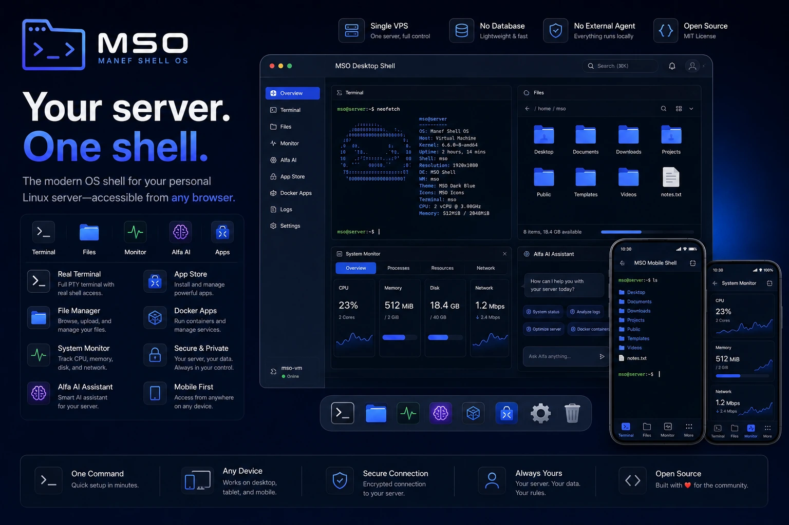
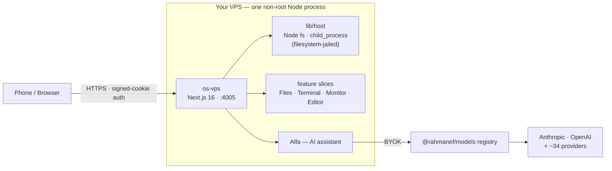

<h1 align="center">Manef Shell OS</h1>

<p align="center">
  A browser-based graphical shell and single-owner control plane for a Linux server you own —<br/>
  terminal, files, metrics, and AI in one desktop-style pane, from any browser (especially your phone).
</p>

<p align="center">
  
  
  
  
  
  
  
</p>

> Naming: the product is **Manef Shell OS** (shown as **MSO** in the UI chrome); the repo/service slug stays `os-vps` (deploy paths, systemd unit, domain).

Administer a headless server from any browser — especially a phone. A real terminal (full PTY — `vim`, `top`, `ssh` all work), file manager, system monitor, media preview and an embedded web browser, in a desktop-style shell. The point is **utility**: fast admin of a headless box without the weight of XRDP/VNC — and because it's just a web app, it's as usable from a phone as from a laptop.



<p align="center">
  
</p>

## What this is — and is NOT

**Manef Shell OS is** a browser-based graphical shell and single-owner control plane that runs *on top of* a Linux server you already own. One authenticated pane gives you a terminal, files, live system metrics, an AI assistant and apps — reachable from any browser.

**It is NOT** an operating system, Linux distribution, kernel or desktop environment · not a hypervisor, container runtime or VPS provider · not multi-tenant and not a SaaS · not a "web shell" backdoor. The macOS, Windows, Android and Dashboard modes are **interface layouts**, not operating systems — the software underneath is a single non-root Node process. The "OS" in the name is a nod to the desktop metaphor, nothing more.

## Install

One command on your VPS — installs prerequisites, builds, and sets up the systemd service:

```bash
curl -fsSL https://raw.githubusercontent.com/rahmanef63/os-vps/main/scripts/install.sh | bash
```

It generates your credentials, prints the first-login password once, and tells you how to pair your first device. Options: `… | bash -s -- --port 4005 --no-service`; remove with `… | bash -s -- --uninstall`. Production details (TLS reverse proxy, hardware sizing, security checklist): **[docs/INSTALL.md](./docs/INSTALL.md)**.

## Architecture

Single Next.js app that runs *on* the server as a normal **non-root** user and talks to the host directly — **no database, no external agent**. Every feature is a self-contained vertical slice under `frontend/slices/<slug>/`, so **adding an app = one slice + one manifest entry**.



Deep dive: **[docs/ARCHITECTURE.md](./docs/ARCHITECTURE.md)**.

## Features

- **Files** — realpath-jailed file manager: browse, upload, drag-and-drop, trash, search + Finder-style type-ahead, "Open with Claude Code" on any folder.
- **Terminal** — a real interactive PTY (`vim`/`top`/`ssh` work), not a one-shot command box.
- **Alfa AI** — built-in assistant, **BYOK + multi-provider**: Anthropic, OpenAI and ~34 OpenAI-compatible providers via a vendored model registry.
- **Multi-shell** — macOS · Windows · iOS · Android desktop metaphors (plus a Dashboard), switchable per surface.
- **More apps** — system monitor, media viewer, layer-based image editor, glanceable widgets, a tabbed embedded web browser, and a one-tap safe disk Cleanup.

## How it compares

Each of these solves one slice of headless-server admin; Manef Shell OS stitches the common ones into a single mobile-first pane.

| | **MSO** | Cockpit | ttyd | FileBrowser | Netdata | Tailscale SSH |
|---|:---:|:---:|:---:|:---:|:---:|:---:|
| Real PTY terminal | ✅ | ✅ | ✅ | — | — | ✅ |
| File manager | ✅ | ~ | — | ✅ | — | — |
| Live system metrics | ✅ | ✅ | — | — | ✅ | — |
| Built-in AI (BYOK) | ✅ | — | — | — | — | — |
| Mobile-first UI | ✅ | — | — | ~ | ~ | — |
| No database / agent | ✅ | ✅ | ✅ | ✅ | ~ | n/a |
| One-command install | ✅ | ~ | ✅ | ✅ | ✅ | ✅ |

<sub>✅ yes · ~ partial · — no</sub>

## Tech stack

| Layer | Tech | Version |
|---|---|---|
| Framework | Next.js (App Router) | 16 |
| UI runtime | React | 19 |
| Styling | Tailwind CSS + shadcn/ui | 4 |
| Language | TypeScript | 5.9 |
| Terminal | node-pty · @xterm/xterm | 1.1 · 6.0 |
| Runtime | Node.js | ≥ 20.9 (22 recommended) |
| Package manager | pnpm | 10.32 |
| Tests | Vitest · Playwright | 4 |

## Local dev

```bash
pnpm install
cp .env.example .env.local   # set OS_LOGIN_PASSWORD + OS_SESSION_SECRET (openssl rand -hex 32)
pnpm dev                     # http://localhost:3000
```

Full guide (layout, quality gates, the deploy/build hazard): **[docs/DEVELOPMENT.md](./docs/DEVELOPMENT.md)**.

## Security

An authenticated session **is the box owner** — real shell and file access as the process user, so treat it like an SSH login. Run it behind Tailscale/VPN or a TLS reverse proxy with an IP allowlist, use a strong `OS_LOGIN_PASSWORD`, and approve only your own devices. Full threat model, mechanics and hardening checklist: **[docs/FAQ.md](./docs/FAQ.md)** · **[docs/INSTALL.md](./docs/INSTALL.md)**.

## Docs

| Doc | What's in it |
|---|---|
| [INSTALL.md](./docs/INSTALL.md) | Production: credentials, systemd, TLS, hardware sizing, security checklist |
| [DEVELOPMENT.md](./docs/DEVELOPMENT.md) | Local dev, quality gates, deploy + the build hazard, pnpm pin |
| [ARCHITECTURE.md](./docs/ARCHITECTURE.md) | AppShell framework, slices, seams, routing |
| [MODELS-INTEGRATION.md](./docs/MODELS-INTEGRATION.md) | Alfa AI: BYOK, multi-provider model registry |
| [FAQ.md](./docs/FAQ.md) · [TROUBLESHOOTING.md](./docs/TROUBLESHOOTING.md) | Security posture, device approval, costs · errors + fixes |
| [SLICE-CATALOG.md](./docs/SLICE-CATALOG.md) · [CHANGELOG.md](./docs/CHANGELOG.md) | Every slice in the repo · chronological deltas |

## Status

Personal tool, **alpha** (v0.1.0) — auth + FS jail implemented and the host layer is bounded, but it has **not** had a third-party security audit. Quality gates (typecheck · lint · vitest · build) run on a pre-push hook; `GET /api/health` gives a liveness probe.

## Related

Part of the Rahman web-OS family: **[Rahman OS](https://shell.rahmanef.com)** (web-OS shell) · **[belajar-with-rahmanef](https://study-with.rahmanef.com)** (learn AI in a browser OS) · **[Rahman Resources](https://resource.rahmanef.com)** (the slice library these UIs are built from).

## License

MIT — see [LICENSE](./LICENSE).
